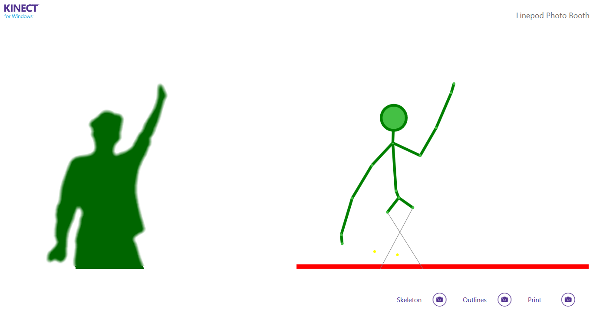

# Linepod Photo Booth

- To run the Photobooth you need a Windows PC.
- Furthermore you need to install Visual Studio and the Kinect SDK v1.8 as described here (https://www.microsoft.com/en-us/download/details.aspx?id=40278) in advance.
- Clone the repo: https://github.com/LinePod/linespacePhotoBooth
- On branch "master" you can find the english demo, on branch "german" is the german version.
- Before starting the application from Visual Studio connect the Kinect to the PC.

